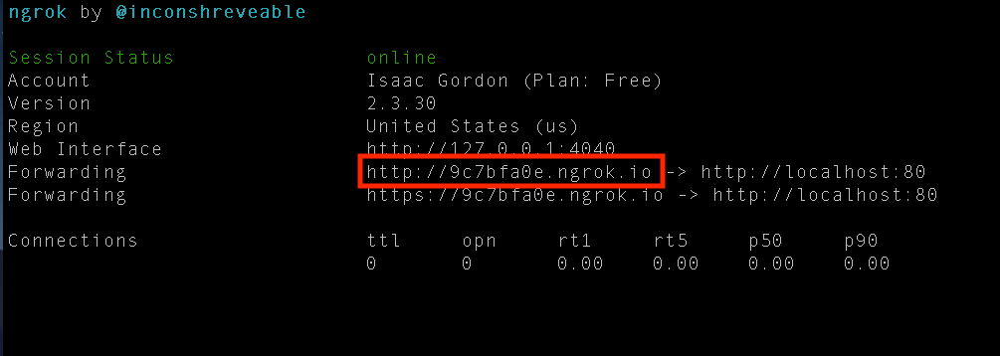
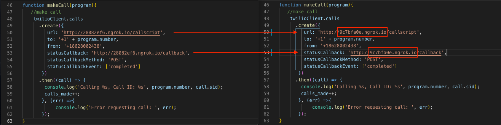
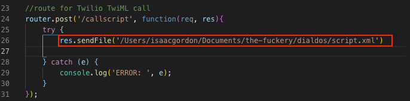

# DialDOS - A Prank Script
This NodeJS script calls a given phone number _n_ times, and uses the Twilio Programmatic Voice API to handle phone calls. 

## Prerequsites
- Node v8.16.0
- NPM v6.4.1 
- Ngrok or other exposed HTTP endpoint
- Twilio API Credentials

## Environment Setup 
1. Clone the repo and install NPM dependencies.
```bash
git clone repo.git
npm install 
```
2. Sign up for a trial Twilio account <a href='https://www.twilio.com' target='_blank'>here</a>.
3. Locate your Twilio AccountSID and API AuthToken, and add them to your `.env.sample` file.
4. Rename `.env.sample` to `.env`.
5. <a href='https://ngrok.com' target='_blank'>Download Ngrok</a> and then follow the setup instructions on the website's dashboard. **OR** You can create a path resource inside your own REST API, where this application will live. 

## How to Run 
**If you are NOT using Ngrok and have your own exposed API, skip to #3**
1. Start ngrok using `ngrok http 80`.
2. Copy the hostname from the terminal:

3. Replace the hostname on lines 50 and 53 of call.js:

4. Make sure your TwiML file is being pointed to, at app.js line 26. To learn about TwiML, see the Twilio documentation. 

5. Run from the command line with appropriate flags:

```bash
-n --number, required, 10 digit US number no hyphens ex 8001234567
-r --repeat, defaults to 1, number of phone calls to be placed
example$ node call.js -n 1234567654 -r 5
``` 

6. Press `Ctrl + C` to cancel the program and remaining queued calls. 

---
_See in-code comments  for an indepth explanation of the script._

--- 
**_DISCLAIMER: Spamming your buddy with phone calls without consent may be considered unethical or perhaps even unlawful in your area. The author makes no garuntees and does not take responsibility for anything you do with this repo._**
